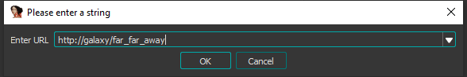

## Memory loader
Memory loader is a DLL based on IDA SDK that allows you to load files into IDA and reverse them
without writing the actual file to the disk. This scenario is very useful when you are reversing a malware
and you have a static detection-based antivirus on your PC. The memory loader itself is a DLL, that
the MemZipLoader and URLLoader are using in order to load the buffers they provide, either from a zip file or URLs into
IDA database  

## Mem Zip loader
Mem Zip Loader uses the memory loader (mentioned above) to load a file from a plain/encrypted zip file. In case the ZIP file is password protected, it will ask for a password.
Then, it will display a dropdown menu with files inside the ZIP, and let you choose one of them.
Finally, it will load the chosen file into memory with the memory loader, without writing anything to disk.  

## URL loader
The URL loader uses the memory loader to load files from an arbitrary URL into memory without writing to disk. The loader first asks the user for a
URL and then tries to download a file from that URL. Then uses the memory loader to load it into IDA. 

## Requirements for developlment
<h4>How to build on Windows with VS 2019 x64:</h4>’
<table>
    <tr>
        <td>1. Open a visual studio DLL project.</td>
    </tr>
    <tr>
        <td>2. Fix the IDK SDK include (Configuration Properties -> C/C++ -> Additional Include Directories), make sure the (.h) header files to match your IDA SDK files paths.</td>
    </tr>
    <tr>
        <td>3. Fix the IDA SDK include libs (Configuration Properties -> Linker -> Additional Library Directories) make sure the *.lib files to match your IDA SDK files paths.</td>
    </tr>
    <tr>
        <td>
            4. Fix the Preprocessor defenitions. (Configuration Properties -> C/C++ -> Preprocessor Definitions)
             &nbsp;&nbsp;&nbsp;&nbsp;x64: define __EA64__
             &nbsp;&nbsp;&nbsp;&nbsp;x86: define __X64__;__NT__ &  undefine: __EA64__
        </td>
    </tr>
    <tr>
        <td>5. This project can be built for IDA 64-bit as 64-bit executable the configuration x64_debug`.</td>
    </tr>
    <tr>
        <td>6. In addition, the project can be built for IDA 64-bit as 32-bit executable with the configuration Debug_32_address_ida.</td>
    </tr>
</table>

## Installation
lace the Memory Loader DLL files in IDA's directory  
The nameing convertion is:
<table>
	<tr>
		<td>x86</td>
        <td>MemoryLoader.dll</td>
	</tr>
	<tr>
		<td>x64</td>
        <td>MemoryLoader64.dll</td>
	</tr>
</table>

Place the loaders files in IDA's loaders directory  
The nameing convertion is:
<table>
	<tr>
		<td>x86</td>
        <td>MemZipLoader.dll</td>
        <td>UrlLoader.dll</td>
	</tr>
	<tr>
		<td>x64</td>
        <td>MemZipLoader64.dll</td>
        <td>UrlLoader64.dll</td>
	</tr>
</table>

## Usage
<table>
	<tr>
		<td>MemZipLoader</td>
        <td>
            The loader accepts ZIP files, opens a dropbox, indexing and displaying all files inside. (recursive directory search)
            The file will be extracted to a buffer without any files being written to the disk.
        </td>
	</tr>
	<tr>
		<td>UrlLoader</td>
        <td>
            The loader is suggested no matter what file you open from the disk. Selecting URL loader disables loading the 
            file you selected and asks for a URL and loads it as a file. The name of the file will be its sha1. The IDB will 
            be placed in the same directory as the original file you opened. The file gets extracted to a buffer 
            without being written to the disk.
        </td>
	</tr>
</table>
	
##  MemLoader & MemZipLoader & UrlLoader Tested On:
<table>
    <tr>
        <td colspan="6">IDA version 7.5+</td>
    </tr>
	<tr>
		<td>x64</td>
		<td>pe</td>
		<td>elf</td>
		<td>arm</td>
		<td>macho</td>
		<td>shellcode(Binary)</td>
	</tr>
	<tr>
		<td>x86</td>
		<td>pe</td>
		<td>elf</td>
		<td>arm</td>
		<td>macho</td>
		<td>shellcode(Binary)</td>
	</tr>
</table>

## Known Issues
* Loaders are working and tesed only for Windows OS.
* X86 PEs in some cases the calling convention settings are not accurate.
* PEs don't get their symbols loaded. Only flirt and types signatures applied.
* MemZipLoader does not support opening zip inside a zip.

## Credits
* This open-source project is backed by [SentinelOne](https://www.sentinelone.com/blog/)
* ZIP Lib [Zip](https://rikyoz.dev/bit7z/)
* IDA SDK [IDA](https://www.hex-rays.com/products/ida/support/sdkdoc/index.html)

